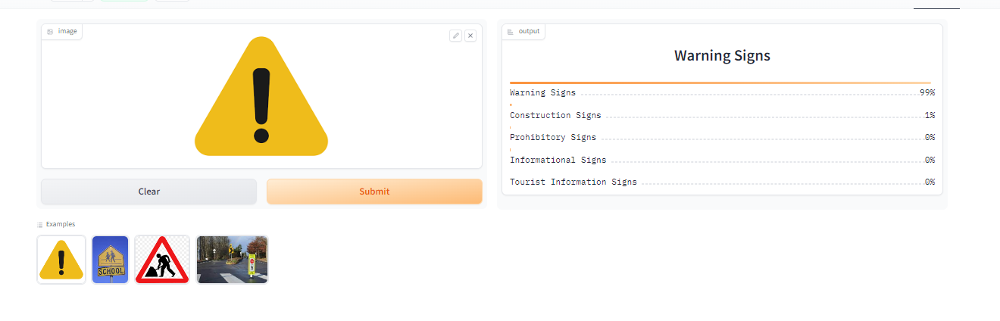
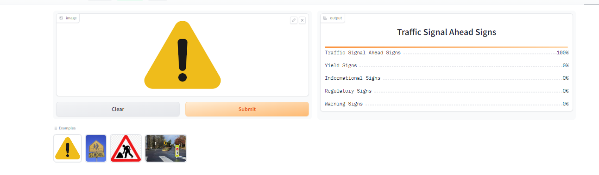
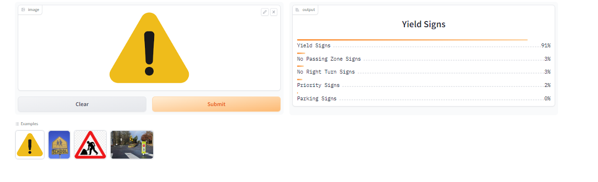
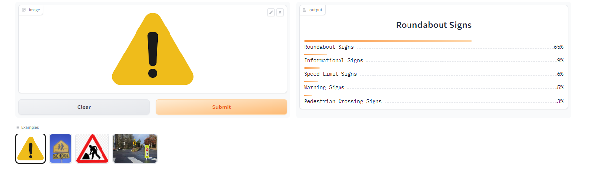
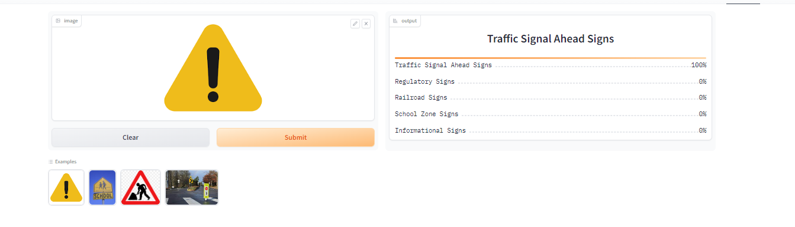

# Traffic_sign_detector
An image classification model from data collection, cleaning, model training, deployment and API integration. 
The model can classify 18 different types of traffic_sign. And deployed the model to HuggingFace Spaces Gradio App.  
The types are following:  
1. Construction Signs
 2. Hospital Signs
 3. Informational Signs
 4. Lane Control Signs
 5. Motorway Signs
 6. Parking Signs 
 7. Pedestrian Crossing Signs
 8. Pedestrian Signs
 9. Priority Signs
 10. Prohibitory Signs
 11. Railroad  Signs
 12. Regulatory Signs
 13. Regulatory Signs for Bicycles
 14. Roundabout Signs
 15. School Zone Signs
 16. Speed Limit Signs
 17. Tourist Information Signs
 18. Warning Signs

 
# Dataset Preparation
 <b>Data Collection: </b> Images are downloaded using the duckduckgo. 
 <b>DataLoader : </b> DataLoader is created using the fastai DataBlock API to handle the dataset. 
 <b>Data Augmentation:</b> Using Fastai provides default data augmentation function that can be applied to images in order to increase dataset.

# Project Summary And Deployment
The recognition task i separately used three pretrained models: ResNet-34, DenseNet-121, and ResNet-50.As well as two separate categories like 18 and 25 categories. The Summary of models and categories describe in below:

 <b>1. ResNet-34</b> 
 
 `For 18 Categories`: After multiple times data cleaning and fine-tuning with the ResNet-34 model on Category 18 signs got an accuracy of 81%. The implementation can be found in [here](https://huggingface.co/spaces/MdRiad/traffic_sign_recognizer).
 
 

 `For 25 Categories`: After multiple times data cleaning and fine-tuning with the ResNet-34 model on Category 25 signs got an accuracy of 80%. The implementation can be found in [here](https://huggingface.co/spaces/MdRiad/traffic_sign_recognizer_resnet34_25cat).
 

<b>2. DenseNet-121</b> 

`For 18 Categories`: After multiple times data cleaning and fine-tuning with the DenseNet-121 model on Category 18 signs got an accuracy of 77%.The implementation can be found in [here](https://huggingface.co/spaces/MdRiad/traffic_sign_recognizer_with_densenet).
 

`For 25 Categories`: After multiple times data cleaning and fine-tuning with the DenseNet-121 model on Category 25 signs got an accuracy of 76.74%.The implementation can be found in [here](https://huggingface.co/spaces/MdRiad/traffic_sign_recognizer_densenet_25_cat).
 

<b>3. ResNet-50</b> 

`For 18 Categories`: After multiple times data cleaning and fine-tuning with the ResNet-50 model on Category 18 signs got an accuracy of 76.85%.The implementation can be found in [here](https://huggingface.co/spaces/MdRiad/traffic_sign_recognizer_resnet50_18_cat).
 

`For 25 Categories`: After multiple times data cleaning and fine-tuning with the ResNet-50 model on Category 25 signs got an accuracy of 78.19%.The implementation can be found in [here](https://huggingface.co/spaces/MdRiad/traffic_sign_recognizer_resnet50_25cat).
 

# API integration with GitHub Pages
The deployed model API is integrated [here](https://github.com/riad5089/Traffic_sign_detector) in GitHub Pages Website. Implementation and other details can be found in `docs` folder.
